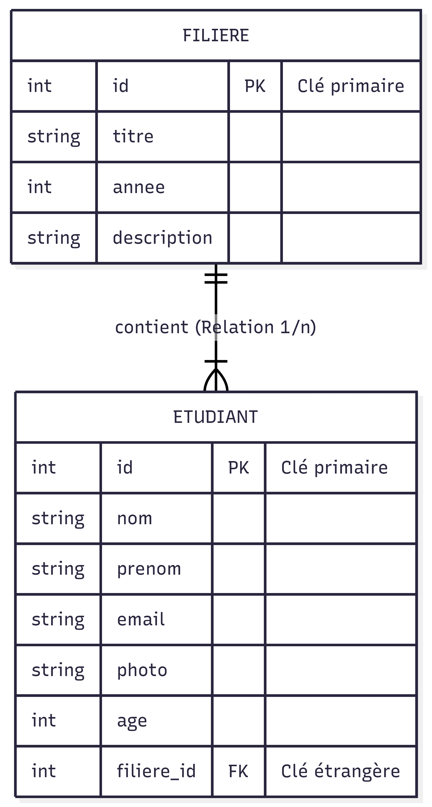

# YearBook

## Structure du projet

```text
YearBook/
|-- index.html          # Page d'accueil (a la racine)
|-- css/                # Tous les fichiers .css
|   |-- style.css
|-- js/                 # Tous les fichiers .javascript
|   |-- script.js
|-- assets/             # Medias et ressources statiques
|   |-- img/            # Photos etudiants & logo
|   |-- docs/           # Schema ERD
|   `-- fonts/
|-- pages/              # Autres fichiers HTML (si site multi-pages)
|   |-- filiere.html    # Liste des etudiants
|   |-- login.html      # Connexion
|   `-- register.html   # Inscription
`-- README.md
```

## Developpement Frontend et Layout

- Integration HTML5/CSS3 : creation d'un layout global coherent en respectant la semantique HTML et les bonnes pratiques SEO.
- Design responsive : garantir une consultation optimale sur tous les supports (Desktop, Tablette, Mobile).

Pages a realiser :

1. Home Page : presentation de l'ecole, liste des filieres (BTS SIO / BTS CIEL) et menu de navigation.
2. Consultation Filiere : affichage de la liste des etudiants par filiere.
3. Authentification : creation des interfaces Connexion (Login) et Enregistrement (Register).

## Modelisation de la base de donnees

### Consigne :

- Conception de l'ERD (Entity Relationship Diagram) : modelisation des relations entre les entites.
- Création de la base de donnée sur mysql

Structure minimale :

- Filiere : titre, annee, description.
- Etudiant : photo, nom, prenom, email (lie a une seule filiere).

### Notre ERD


## Gestion de version et collaboration
### Consignes : 

- Initialisation du repository GitHub : mise en place de l'arborescence du projet.
- Collaboration : ajout de l'intervenant (jeromeborg) en tant que contributeur.
- Livrables : code source a jour sur le repo et schema de la base de donnees (ERD) en fin de journee.


## Contraintes techniques

- Format : uniquement du HTML/CSS (pas de PHP pour cette session).
- CSS : fichier externe obligatoire (pas de style inline).
- Outils : utilisation de frameworks ou templates CSS autorisee ; usage de l'IA interdit.
