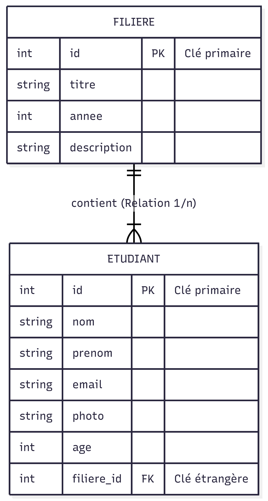

# YearBook

## Structure du projet

```text
YearBook/
|-- public/                     # Racine web (point d'entree du serveur)
|   |-- index.html              # Page d'accueil statique
|   |-- index.php               # Page d'accueil dynamique PHP
|   |-- css/
|   |   `-- style.css
|   `-- js/
|       `-- script.js
|-- template/                   # Templates PHP des pages
|   |-- sio.php                 # Liste des etudiants BTS SIO
|   |-- ciel.php                # Liste des etudiants BTS CIEL
|   |-- login.php               # Connexion
|   |-- register.php            # Inscription
|   |-- contact.php             # Contact
|   |-- mentions-legales.php    # Mentions legales
|   |-- bdd.php                 # Connexion a la base de donnees
|   `-- partials/               # Composants reutilisables
|       |-- header.php
|       `-- footer.php
|-- assets/                     # Medias et ressources statiques
|   |-- images/                 # Photos etudiants & MCD
|   `-- logoMDS.png
|-- yearbook.sql                # Script de creation de la base de donnees
`-- README.md
```

## Developpement Frontend et Layout

- Integration HTML5/CSS3 : creation d'un layout global coherent en respectant la semantique HTML et les bonnes pratiques SEO.
- Design responsive : garantir une consultation optimale sur tous les supports (Desktop, Tablette, Mobile).

Pages realisees :

1. Home Page : presentation de l'ecole, liste des filieres (BTS SIO / BTS CIEL) et menu de navigation.
2. Consultation Filiere SIO / CIEL : affichage de la liste des etudiants par filiere avec boucle BDD.
3. Authentification : interfaces Connexion (Login) et Enregistrement (Register).
4. Contact : formulaire de contact.
5. Mentions legales.

## Integration PHP

- Migration des pages HTML vers PHP avec inclusion des partials (header/footer).
- Connexion a la base de donnees MySQL via `template/bdd.php`.
- Boucle de recuperation et d'affichage des etudiants depuis la BDD sur les pages SIO et CIEL.
- Separation du code : logique metier dans `template/`, assets statiques dans `public/`.

## Modelisation de la base de donnees

### Consigne :

- Conception de l'ERD (Entity Relationship Diagram) : modelisation des relations entre les entites.
- Création de la base de donnée sur mysql

Structure minimale :

- Filiere : titre, annee, description.
- Etudiant : photo, nom, prenom, email (lie a une seule filiere).

### Notre ERD


## Gestion de version et collaboration
### Consignes : 

- Initialisation du repository GitHub : mise en place de l'arborescence du projet.
- Collaboration : ajout de l'intervenant (jeromeborg) en tant que contributeur.
- Livrables : code source a jour sur le repo et schema de la base de donnees (ERD) en fin de journee.


## Contraintes techniques

- Langages : HTML5, CSS3, PHP, SQL (MySQL).
- CSS : fichier externe obligatoire (pas de style inline).
- Architecture : separation `public/` (racine web) / `template/` (logique PHP).
- Outils : utilisation de frameworks ou templates CSS autorisee.
